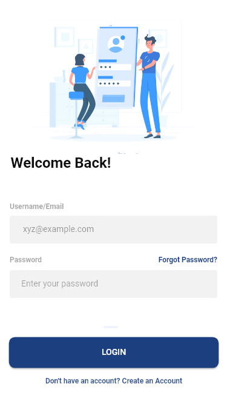

# login_ui

Primeira UI em flutter, essa UI foi retirada da plataforma dribbble e eu tentei ser o mais fiel possível a ela.

UI original: 

Cópia da UI: 

Obs:
===

Ainda tenho uns problemas com a fidelidade dos inputs e de outras questões que acabam destoando muito do contexto da Ui.

Packages Utilizados:
===
1. flutter_svg: ^0.17.3+1

Imagens Utilizadas: 
===
Fonte:undraw.co

